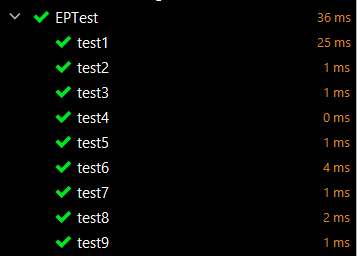
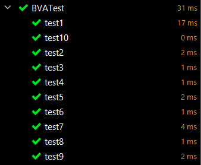

# BÀI TOÁN TÍNH GIÁ VÉ TÀU
## Sinh viên thực hiện
- Họ và tên: Quách Ngọc Minh 
- Mã sinh viên: 20020261

## Mục lục
- [Nội dung bài toán](#Nội-dung-bài-toán)
- [Quá trình sinh các bộ test](#Quá-trình-sinh-các-bộ-test)
- [Kết quả kiểm thử](#Kết-quả-kiểm-thử)

## Nội dung bài toán
Giả sử các chuyến tàu khởi hành từ 0h đến trước 9h và từ 17h đến trước 19h (giờ cao điểm) 
có giá 60000 đồng, các chuyến khởi hành từ 9h đến 17h và từ 19h đến trước 24h
có giá 40000 đồng. Trẻ em dưới 6 tuổi được miễn vé tàu, 
trẻ từ 6 đến 10 tuổi được giảm 25%, người cao tuổi từ 60 tuổi được giảm 15%.
Cho rằng tàu chỉ khởi hành vào các giờ đúng 
và giá trị tuổi khách hàng trong khoảng từ 0 đến 200.
Phương thức `int trainFareCalculate()` tính giá vé tàu khi cho biết giờ khởi hành và tuổi khách hàng, trả về -1 với đầu vào không hợp lệ.

## Quá trình sinh các bộ test
Vì kiểm thử phân tích giá trị biên mạnh có quá nhiều trường hợp, 
kiểm thử phân tích giá trị biên đơn giản nhất không bao quát hết được các trường hợp có thể của đầu ra
còn kiểu thử phân hoạch tương đương có thể bỏ qua lỗi sai nào đó ở biên nên ta 
sẽ sinh 2 bộ test cho 2 kỹ thuật kiểm thử biên đơn giản nhất và kiểm thử phân hoạch tương đương.

Gọi h là giờ tàu khởi hành, age là độ tuổi khách hàng.
Ta có:
* h, age &#8712; N (kiểu Int)
* h &#8712; [0, 24)
* age &#8712; \[0, 200]

### Bộ test thứ 1: Kiểm thử phân hoạch tương đương theo giá trị đầu ra
Ta có bảng giá trị đầu ra dựa theo đầu vào như sau:

|STT| Điều kiện đầu vào  | Đầu ra  |
|---|---|---|
| 1|h &#8712; (MinInt, 0) &#8746; [24, MaxInt), age bất kì |-1|
| 2|h bất kì, age &#8712; (MinInt, 0) &#8746; (200, MaxInt)|-1|
| 3| h &#8712; [0, 24), age &#8712; [0, 6)                 |0|
| 4|h &#8712; \[0, 9) &#8746; \[17, 19), age &#8712; \[6, 10]|45000|
| 5|h &#8712; \[9, 17) &#8746; \[19, 24), age &#8712; \[6, 10]|30000|
| 6|h &#8712; \[0, 9) &#8746; \[17, 19), age &#8712; (10, 60)|60000|
| 7|h &#8712; \[9, 17) &#8746; \[19, 24), age &#8712; (10, 60)|40000|
| 8|h &#8712; \[0, 9) &#8746; \[17, 19), age &#8712; \[60, 200]|51000|
| 9|h &#8712; \[9, 17) &#8746; \[19, 24), age &#8712; \[60, 200]|34000|

Như vậy, ta phân tập giá trị H, AGE thành các tập tương đương mà các thành phần
trong mỗi tập dẫn đến cùng một kết quả đầu ra như sau:
* H1 = (MinInt, 0) &#8746; [24, MaxInt)
* AGE1 = \[MinInt, MaxInt]

* H2 = \[MinInt, MaxInt]
* AGE2 = (MinInt, 0) &#8746; (200, MaxInt)

* H3 = [0, 24)
* AGE3 = [0, 6)

* H4 = [0, 9) &#8746; [17, 19)
* AGE4 = \[6, 10]

* H5 = [9, 17) &#8746; [19, 24)
* AGE5 = \[6, 10]

* H6 = [0, 9) &#8746; [17, 19)
* AGE6 = \(10, 60)

* H7 = [9, 17) &#8746; [19, 24)
* AGE7 = \(10, 60)

* H8 = [0, 9) &#8746; [17, 19)
* AGE8 = [60, 200)

* H9 = [9, 17) &#8746; [19, 24)
* AGE9 = [60, 200)

Trong đó: 
* H = H1 &#8746; H2 &#8746; ... &#8746; H9
* AGE = AGE1 &#8746; AGE2 &#8746; ... &#8746; AGE9

Từ đó, ta có bộ test như sau:

| ID | Input h | Input age | Expected Output |
|---|---|---|---|
| 1| 24 | 5 |-1|
| 2| 5  |201|-1|
| 3| 12|3 |0|
| 4|8|8|45000|
| 5|16|8|30000|
| 6|8|36|60000|
| 7|16|36|40000|
| 8|8|67|51000|
| 9|16|67|34000|

### Bộ test thứ 2: Kiểm thử phân tích giá trị biên đơn giản nhất
Bài toán gồm các giá trị biên và nom sau:
* Giá trị biên của h là: 0, 9, 17, 19, 24
* Giá trị nom của h là: 12
* Giá trị biên của age là: 0, 6, 10, 60, 200
* Giá trị nom của age là: 100

Kết hợp các giá trị trên, ta có:

| ID | Input h | Input age | Expected Output |
|---|---|---|---|
| 1| 0|  100 |51000|
| 2| 9|  100 |34000|
| 3| 17| 100 |51000|
| 4| 19| 100 |34000|
| 5| 24| 100 |-1|
| 6| 12| 0 |0|
| 7| 12| 6 |30000|
| 8| 12| 10 |30000|
| 9| 12| 60 |34000|
| 10| 12| 200|34000|

## Kết quả kiểm thử
### Mã nguồn bộ test sử dụng TestNG
* Bộ test kiểm thử theo phân hoạch tương đương: [EPTest.java](./src/main/java/EPTest.java)
* Bộ test kiểm thử phân tích giá trị biên: [BVATest.java](src/main/java/BVATest.java)

### Đoạn mã được kiểm thử
```java
public class trainFareCalculating {

    public static int trainFareCalculate(int h, int age) {
        if(!isValidAge(age) || !isValidHour(h)) {
            return -1;
        }
        if (age >= 0 && age < 6) {
            return 0;
        }
        if (isPeakHour(h)) {
            if (age >= 6 && age <= 10) return 45000;
            if (age > 10 && age < 60) return 60000;
            return 51000;
        }
        // (h >= 9 && h < 17) || (h >= 19 && h < 24)
        if (age >= 6 && age <= 10) return 30000;
        if (age > 10 && age < 60) return 40000;
        return 34000;
    }


    /**
     * @param h
     * @return true if the hour is valid.
     */
    private static boolean isValidHour(int h) {
        return (h >= 0 && h < 24);
    }

    /**
     * @param age
     * @return true if the age is valid.
     */
    private static boolean isValidAge(int age) {
        return (age >= 0 && age <= 200);
    }

    /**
     * @param h
     */
    private static boolean isPeakHour(int h) {
        return (h >= 0 && h < 9) || (h >= 17 && h < 19);
    }
}
```

### Kết quả
1. Chạy bộ test thứ nhất (EPTest):

| ID | Input h | Input age | Expected Output | Actual Output | Result |
|---|---|---|---|---|---|
| 1| 24 | 5 |-1|-1|Passed|
| 2| 5  |201|-1|-1|Passed|
| 3| 12|3 |0|0|Passed|
| 4|8|8|45000|45000|Passed|
| 5|16|8|30000|30000|Passed|
| 6|8|36|60000|60000|Passed|
| 7|16|36|40000|40000|Passed|
| 8|8|67|51000|51000|Passed|
| 9|16|67|34000|34000|Passed|



2. Chạy bộ test thứ hai (BVATest):

| ID | Input h | Input age | Expected Output | Actual Output | Result |
|---|---|---|---|---|---|
| 1| 0|  100 |51000|51000|Passed|
| 2| 9|  100 |34000|34000|Passed|
| 3| 17| 100 |51000|51000|Passed|
| 4| 19| 100 |34000|34000|Passed|
| 5| 24| 100 |-1|-1|Passed|
| 6| 12| 0 |0|0|Passed|
| 7| 12| 6 |30000|30000|Passed|
| 8| 12| 10 |30000|30000|Passed|
| 9| 12| 60 |34000|34000|Passed|
| 10| 12| 200|34000|34000|Passed|



